# Results: original YOLOv8n and Trial 044

This report keeps the recorded training/clean-validation evidence separate from validation plots regenerated on 18 September 2026. No model was retrained to create this report.

## Interpretation

The original and Trial 044 use different recorded training and validation authorities, image resolutions, schedules, and starting checkpoints. The observed differences are descriptive, not a controlled same-data ablation or proof that one code change caused the improvement. Historical Trial 044 was a CPU recipe; the packaged completed comparison is its RTX 3080 adaptation.

Held-out test evaluation was not run. The combined Release pool has no globally held-out image set: an image excluded by one authority may appear under another authority. No test authority was materialized or evaluated during this work. All reported accuracy is validation-only.

## Recorded final validation

| Measure | Original | Trial 044 |
| --- | ---: | ---: |
| Precision | 0.976060 | 0.994192 |
| Recall | 0.973197 | 0.991924 |
| F1 | 0.974627 | 0.993057 |
| mAP50 | 0.981800 | 0.992828 |
| mAP50-95 | 0.555061 | 0.758482 |
| Parameters | 3006818 | 3006818 |
| Checkpoint size (MiB) | 5.968 | 6.037 |
| Inference latency (ms/image) | 2.637 | 4.771 |
| Training duration (seconds) | 14266.4 | 7401.07 |
| Completed epochs | 100 | 27 |
| Best epoch (recorded validation mAP50-95) | 97 | 12 |
| Validation image size | 640 | 1024 |
| Validation images | 3416 | 3414 |

Sources: [original clean validation](results/metrics/original_clean_validation.json), [Trial 044 clean validation](results/metrics/enhanced_clean_validation.json), and [comparison CSV](results/comparison/comparison.csv). F1 is the harmonic mean of the reported aggregate precision and recall. Training duration is the final cumulative CSV time and excludes the separate clean-validation pass. Latency is hardware- and run-dependent; the different input resolutions limit direct efficiency comparisons.

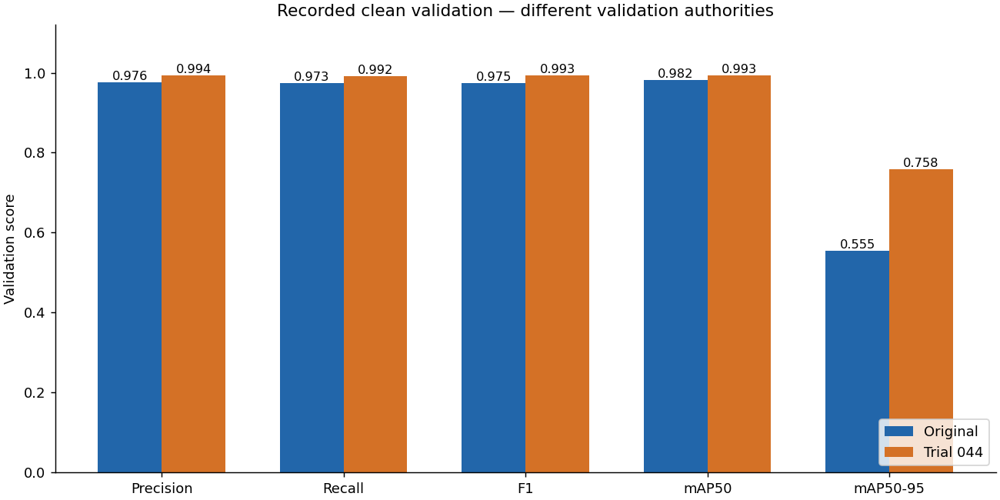

## Training history

The original completed all 100 configured epochs. Trial 044 had a maximum of 60 epochs but completed at epoch 27: epoch 12 was best and `patience=15` stopped training after 15 epochs without improvement. This was a completed early-stopped run, not a partially collected history. Trial 044's head-only continuation begins from an already trained parent, so its curves should not resemble fresh full-model training.

Both panels use every saved epoch, show the same loss and metric families, and keep score axes on 0–1. Loss values reflect their respective training objectives; comparing their raw magnitudes is not a controlled loss ablation. The chart generator selects the best epoch using the recorded validation mAP50-95 column.

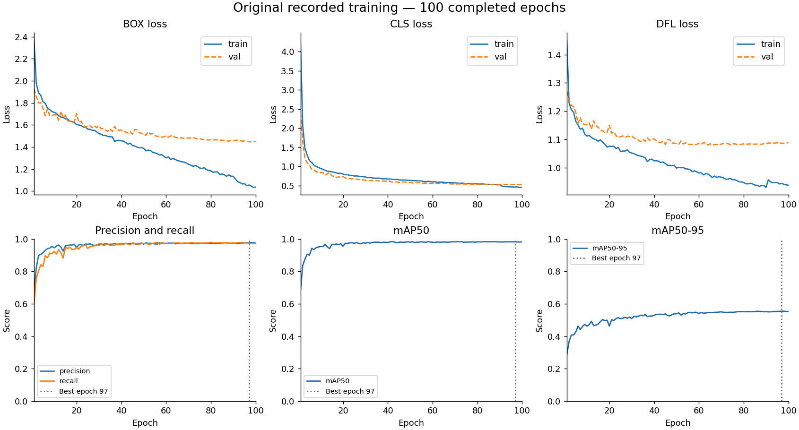

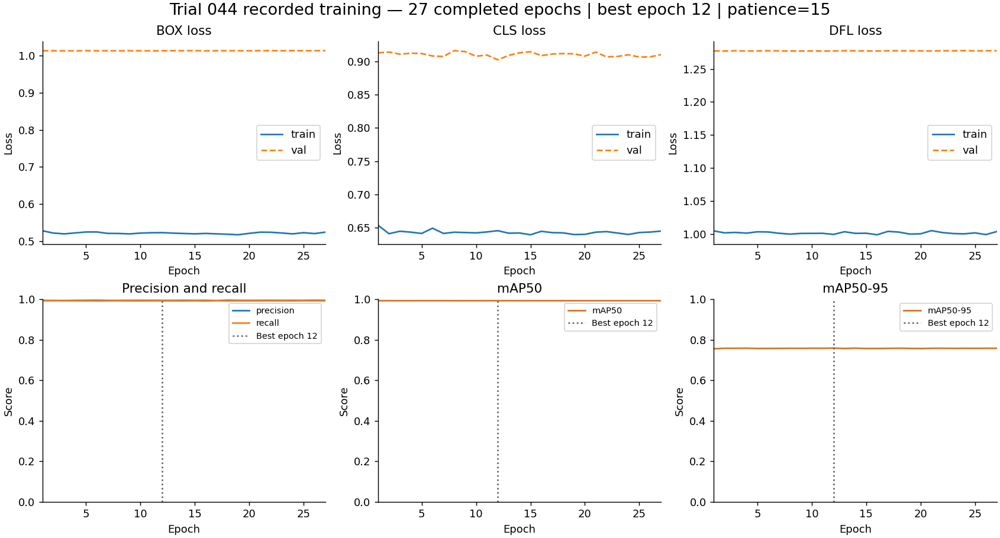

Sources: [original results.csv](results/original/training/results.csv), [Trial 044 results.csv](results/trial044_gpu_adaptation/training/results.csv), [Trial 044 early-stopping configuration](reproducibility/configs/trial044_gpu_adaptation/historical_cpu_trial044.json). [Chart source hashes](results/charts/source_hashes.json) identify the exact inputs.

## Per-class recorded results

| Class | Original P | Trial 044 P | Original R | Trial 044 R | Original AP50 | Trial 044 AP50 | Original AP50-95 | Trial 044 AP50-95 |
| --- | ---: | ---: | ---: | ---: | ---: | ---: | ---: | ---: |
| missing_hole | 0.9739 | 0.9948 | 0.9935 | 0.9983 | 0.9918 | 0.9948 | 0.5666 | 0.7578 |
| mouse_bite | 0.9803 | 0.9948 | 0.9829 | 0.9944 | 0.9924 | 0.9944 | 0.5683 | 0.7582 |
| open_circuit | 0.9836 | 0.9975 | 0.9784 | 0.9983 | 0.9882 | 0.9950 | 0.5398 | 0.7208 |
| short | 0.9763 | 0.9885 | 0.9602 | 0.9808 | 0.9677 | 0.9845 | 0.5668 | 0.7635 |
| spur | 0.9740 | 0.9972 | 0.9496 | 0.9886 | 0.9650 | 0.9947 | 0.5313 | 0.7750 |
| spurious_copper | 0.9683 | 0.9923 | 0.9745 | 0.9911 | 0.9856 | 0.9937 | 0.5575 | 0.7755 |

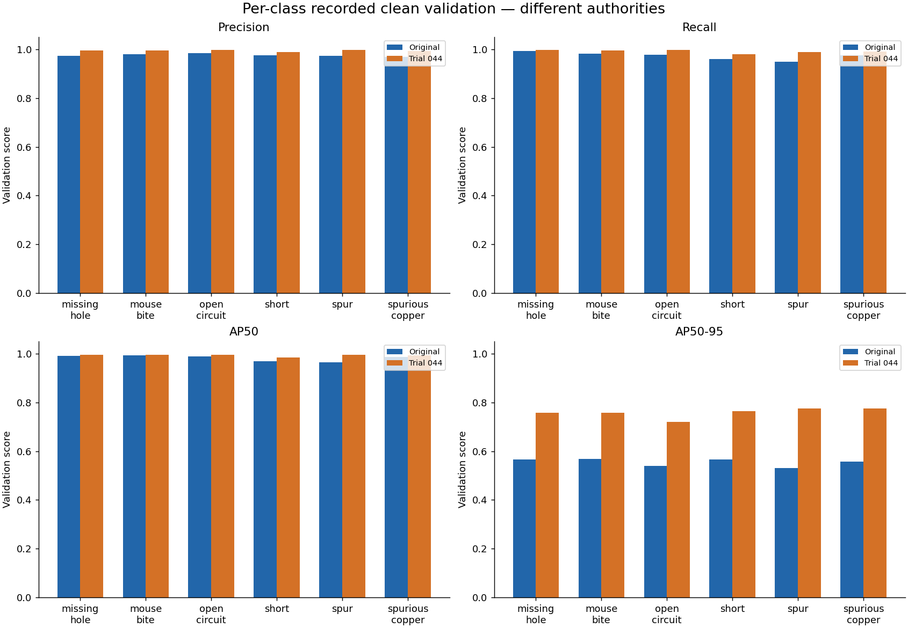

## Regenerated validation plots

Both preserved best checkpoints were evaluated with `split='val'`, `conf=0.001`, `iou=0.7`, `max_det=300`, `augment=False`, `plots=True`, and `workers=0`. The original used `imgsz=640, batch=8`; Trial 044 used `imgsz=1024, batch=3`. Both ran on NVIDIA GeForce RTX 3080 with Python 3.11.9, PyTorch 2.11.0+cu128 and Ultralytics 8.4.84.

| Run | UTC start | UTC finish | Validation seconds | Regenerated mAP50-95 |
| --- | --- | --- | ---: | ---: |
| Original | 2026-09-18T15:54:35.851118+00:00 | 2026-09-18T15:56:03.296105+00:00 | 87.45 | 0.555060867 |
| Trial 044 | 2026-09-18T15:56:03.312432+00:00 | 2026-09-18T15:57:47.842492+00:00 | 104.53 | 0.758482340 |

Tiny numerical differences from the recorded clean-validation metrics are retained in the new provenance, not substituted into the recorded comparison. The regeneration reads the exact hash-attested model-specific validation manifests. Runtime YAML/manifest hashes depend on the extraction location; published authority and checkpoint hashes remain portable.

### Original

[Validation provenance](results/regenerated_validation/original/provenance.json) records checkpoint identity, source/published/runtime authority hashes, timestamps, settings, runtime details, output hashes, `training_performed=false`, and `test_split_used=false`.

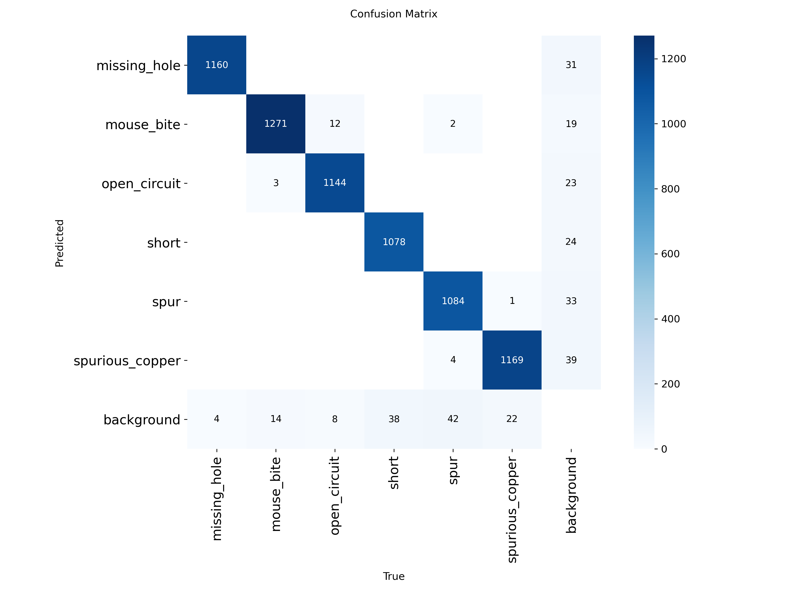

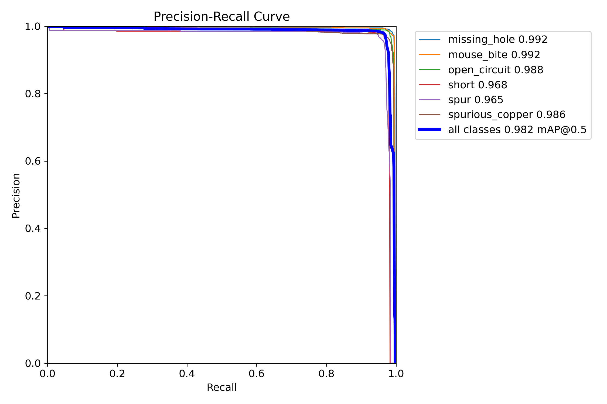

| Confidence curves | Link |
| --- | --- |
| F1 | [F1 curve](results/regenerated_validation/original/BoxF1_curve.png) |
| Precision | [Precision curve](results/regenerated_validation/original/BoxP_curve.png) |
| Recall | [Recall curve](results/regenerated_validation/original/BoxR_curve.png) |

Prediction examples are a small deterministic first-three-batch sample from this model's own validation authority, not paired images or a quality-selected sample. Their matching labels and predictions are kept separately from historical training images in [prediction_examples](results/regenerated_validation/original/prediction_examples).

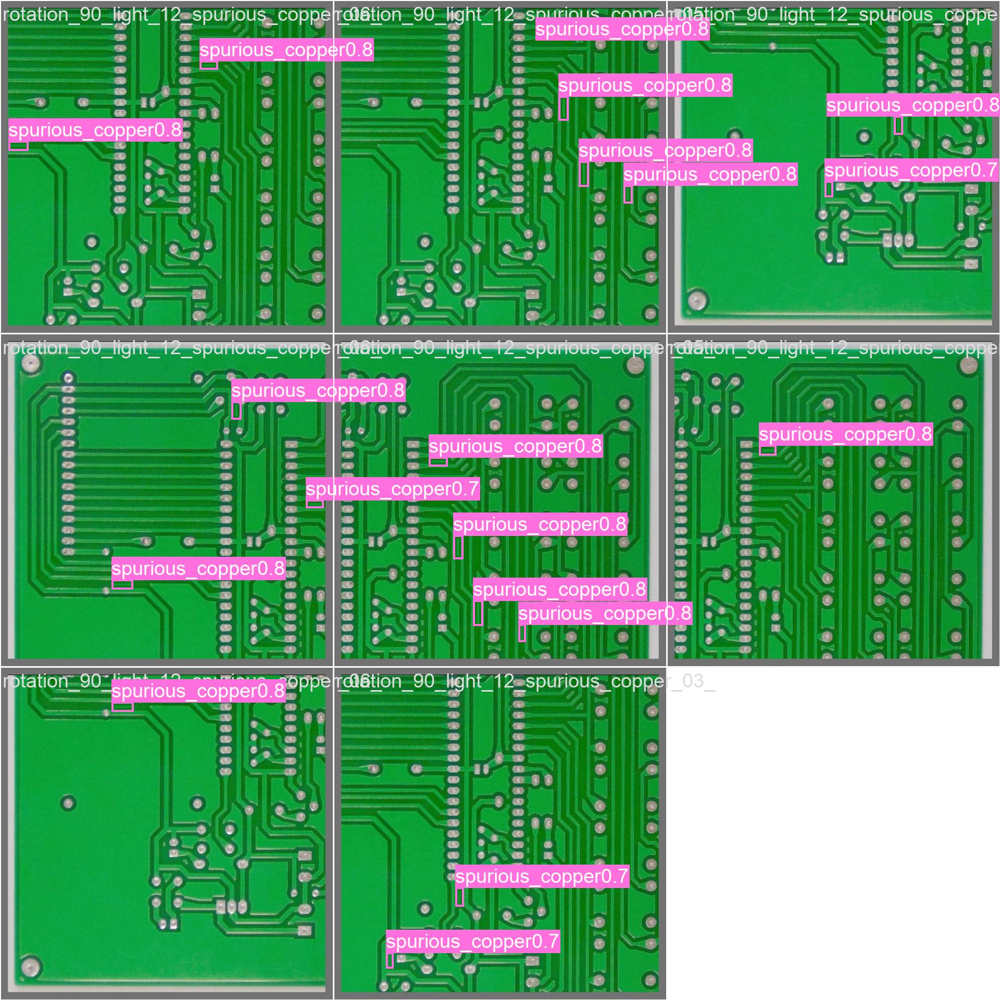

### Trial 044

[Validation provenance](results/regenerated_validation/trial044/provenance.json) records checkpoint identity, source/published/runtime authority hashes, timestamps, settings, runtime details, output hashes, `training_performed=false`, and `test_split_used=false`.

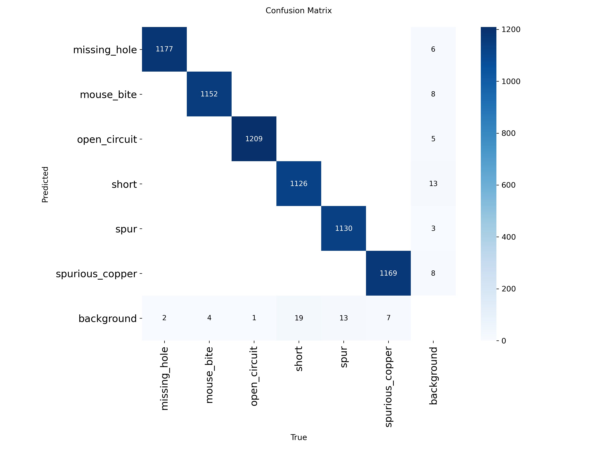

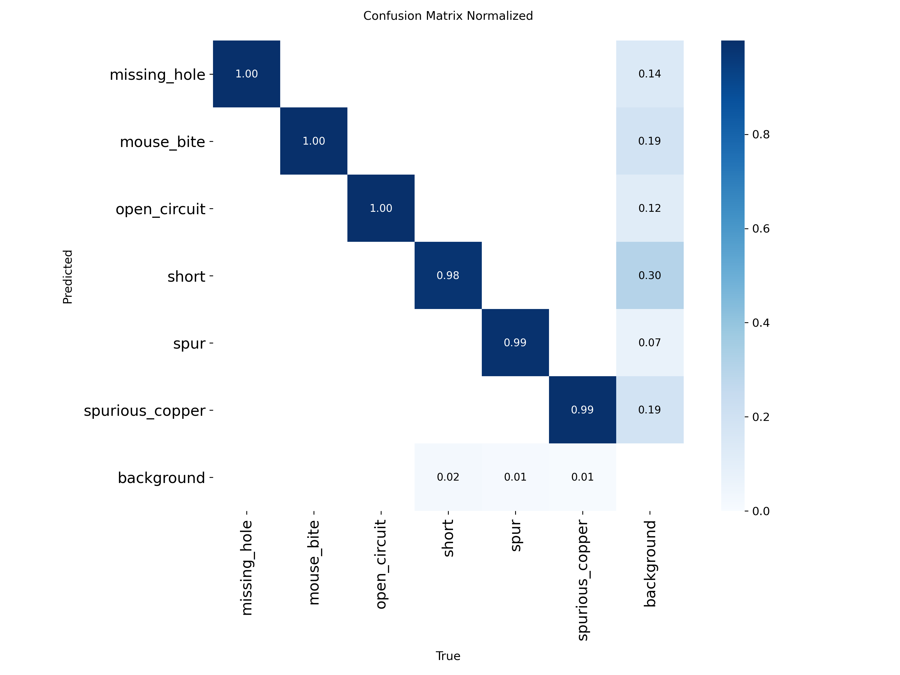

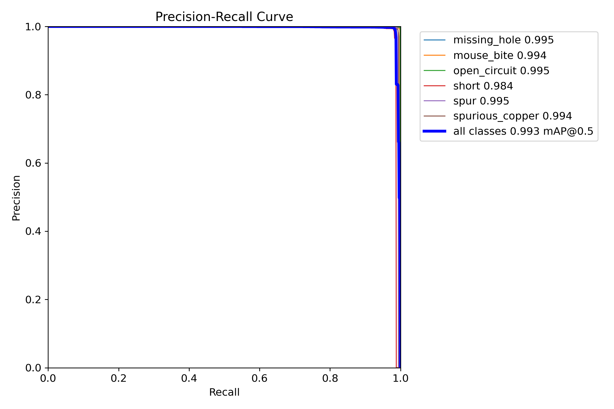

| Confidence curves | Link |
| --- | --- |
| F1 | [F1 curve](results/regenerated_validation/trial044/BoxF1_curve.png) |
| Precision | [Precision curve](results/regenerated_validation/trial044/BoxP_curve.png) |
| Recall | [Recall curve](results/regenerated_validation/trial044/BoxR_curve.png) |

Prediction examples are a small deterministic first-three-batch sample from this model's own validation authority, not paired images or a quality-selected sample. Their matching labels and predictions are kept separately from historical training images in [prediction_examples](results/regenerated_validation/trial044/prediction_examples).

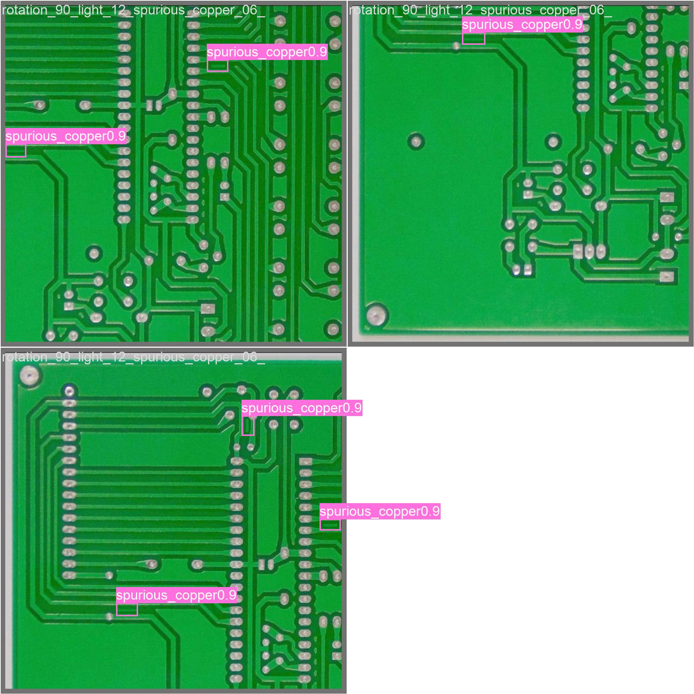

## Recreate and audit

From `custom_yolo_pcb`, run `python reproducibility/generate_charts.py` to recreate the balanced charts from the saved inputs. To run fresh validation without overwriting the packaged figures, use `python reproducibility/regenerate_validation.py --output-dir results/local_vscode_comparison_validation_new`.

The [beginner guide](README.md) explains environment installation, checksum-verified dataset extraction, training, and verification. [Artifact provenance](reproducibility/manifests/hashes/artifact_provenance.json) binds the preserved checkpoints, training CSVs, configs and metrics to their source hashes. The required [private-use notice](reproducibility/PRIVATE_USE_NOTICE.md) and [dataset authorization](reproducibility/DATASET_PROVENANCE.md) remain part of the package.
