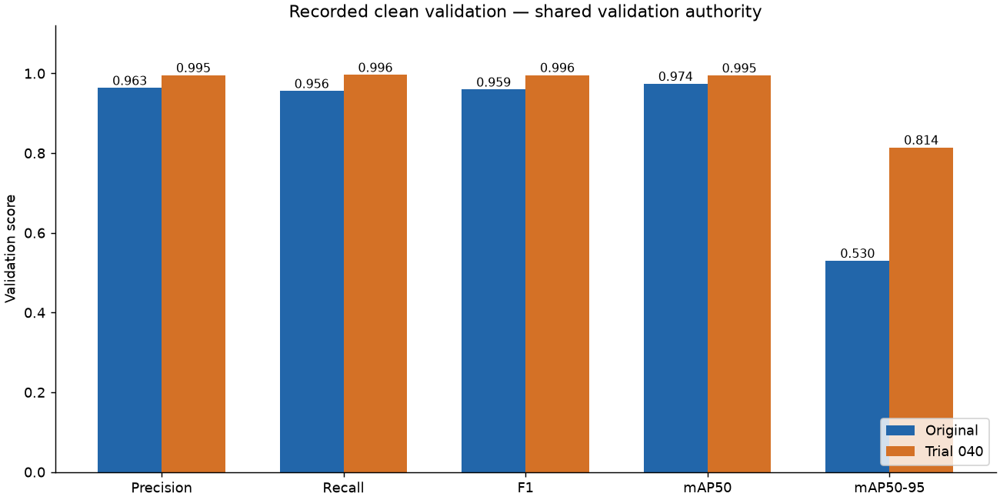
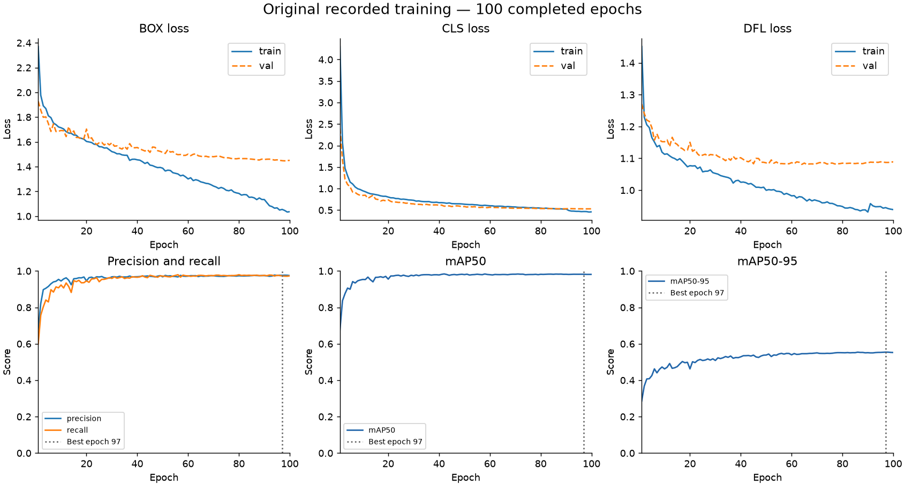
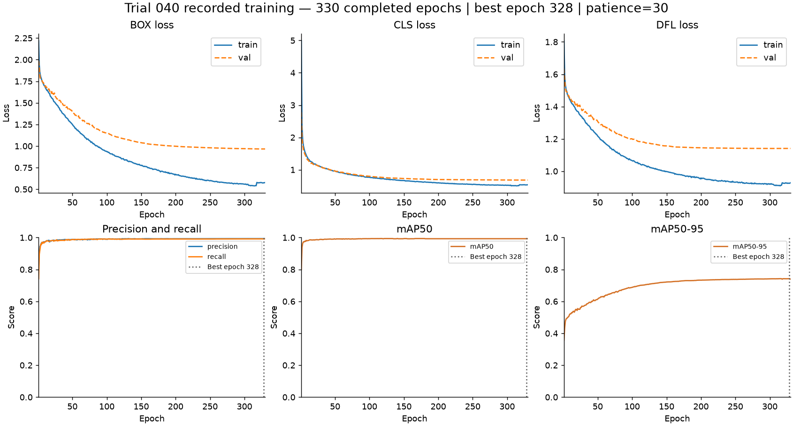
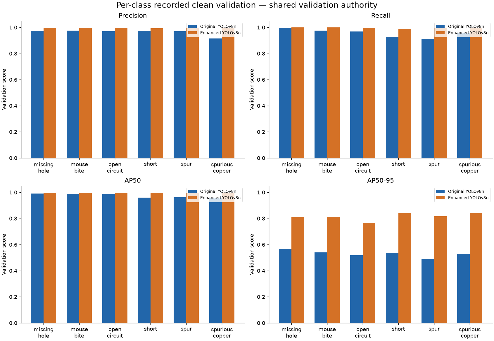
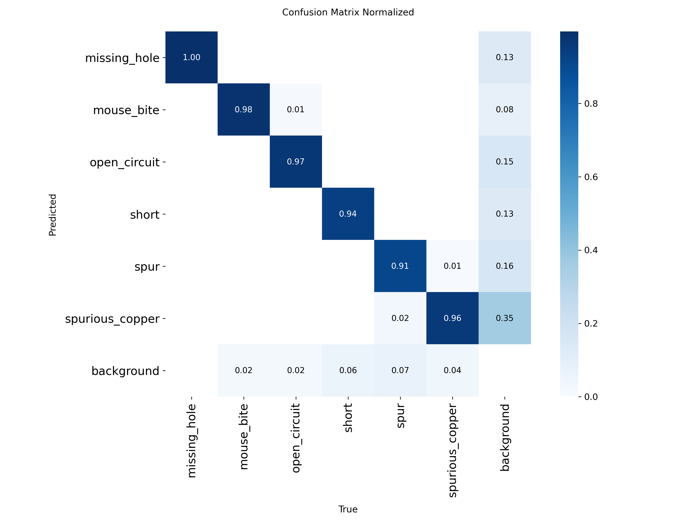
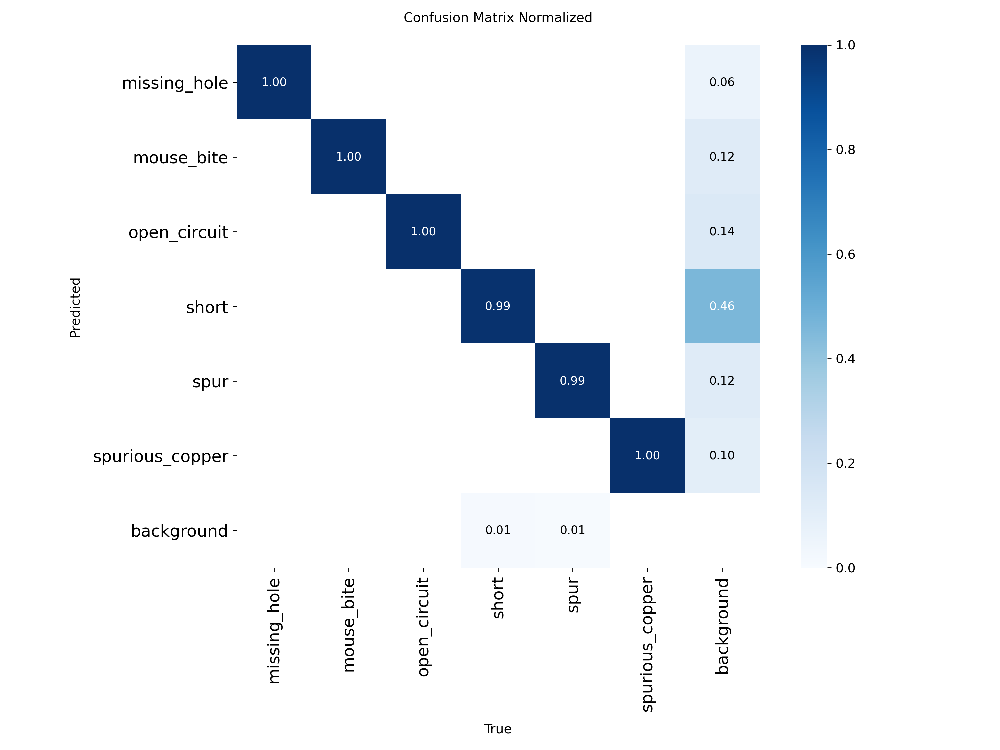
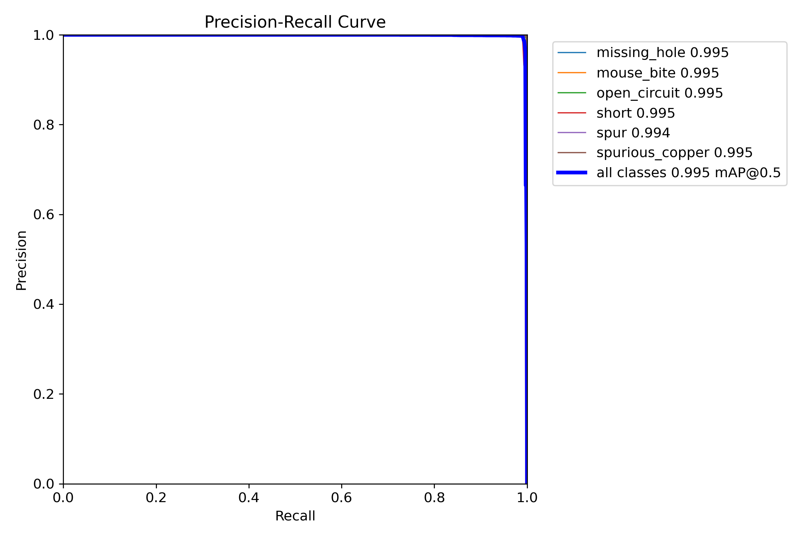
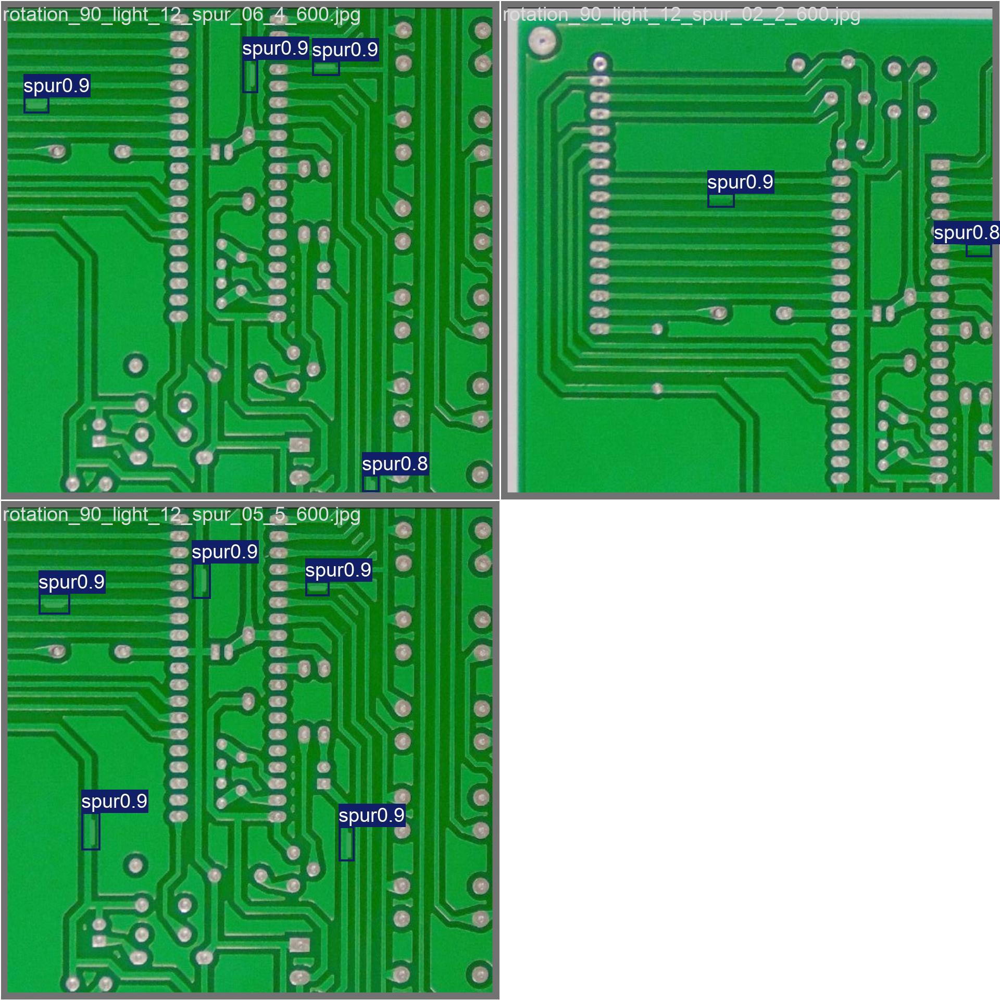

# Results: original and Selected Enhanced YOLOv8n

## Conclusion

The Selected Enhanced YOLOv8n beats the original on every aggregate accuracy metric when both preserved best checkpoints are evaluated on the exact same 3,416-image grouped-v1 validation authority and settings.

| Metric | Original | Enhanced YOLOv8n | Difference |
| --- | ---: | ---: | ---: |
| Precision | 0.963324 | 0.995439 | +0.032115 |
| Recall | 0.955543 | 0.996155 | +0.040612 |
| F1 | 0.959418 | 0.995797 | +0.036379 |
| mAP50 | 0.973787 | 0.994761 | +0.020974 |
| mAP50-95 | 0.529946 | 0.814235 | +0.284288 |
| Short AP50-95 | 0.536335 | 0.838600 | +0.302265 |

Sources: [original metrics](results/metrics/original_clean_validation.json), [enhanced-model metrics](results/metrics/trial040_clean_validation.json), and [comparison CSV](results/comparison/comparison.csv).

## Fairness boundary

Both checkpoints used `split=val`, `imgsz=1024`, `batch=3`, `conf=0.001`, `iou=0.7`, `max_det=300`, `augment=false`, and `workers=0`. The authority ID is `grouped_v1_shared_validation`; neither model used the held-out test split.

The training methods intentionally differ. The original used the grouped-v1 training recipe at 640 pixels for 100 epochs. The enhanced model used a Short x1.25 oversampled training view at 1024 pixels for 330 epochs. Therefore this supports a fair final model comparison, not a claim that one isolated hyperparameter caused the improvement.

## Enhanced model identity

Selected Enhanced YOLOv8n is the public name for internal candidate `Trial 040`. The internal identifier and `weights/trial040_best.pt` filename are retained only for reproducibility and hash traceability. This is one YOLOv8n model initialized from official `yolov8n.pt`; it was not initialized from another candidate's `best.pt`. Same-run recovery from its own `last.pt` is allowed only to finish that same training run and is not a second model improvement. It does not reproduce the older checkpoint-continuation method described elsewhere in the source Word report.

The Selected Enhanced YOLOv8n completed 330 epochs; validation mAP50-95 selected epoch 328. At that epoch, recorded losses were:

| Loss | Train | Validation |
| --- | ---: | ---: |
| Box | 0.57592 | 0.96621 |
| Classification | 0.53102 | 0.67986 |
| DFL | 0.92529 | 1.14074 |
| Sum | 2.03223 | 2.78681 |

Loss magnitudes describe each recipe's optimization history; they are not a controlled loss-function ablation.

## Per-class matched validation

| Class | Original AP50-95 | Enhanced YOLOv8n AP50-95 |
| --- | ---: | ---: |
| missing_hole | 0.567021 | 0.809511 |
| mouse_bite | 0.539898 | 0.812883 |
| open_circuit | 0.518573 | 0.768239 |
| short | 0.536335 | 0.838600 |
| spur | 0.488056 | 0.817585 |
| spurious_copper | 0.529797 | 0.838591 |

## Validation plots and examples

The regenerated directories contain confusion matrices, PR/F1/precision/recall curves, prediction examples, and hash-recorded provenance. No training occurred during regeneration.

- [Original validation provenance](results/regenerated_validation/original/provenance.json)
- [Enhanced-model validation provenance](results/regenerated_validation/trial040/provenance.json)

## Local inspection

The notebook generates the committed `app.py`, which loads only the hash-verified Selected Enhanced YOLOv8n checkpoint for uploaded-image inference. Uploaded images remain in memory and do not alter this validation evidence.
